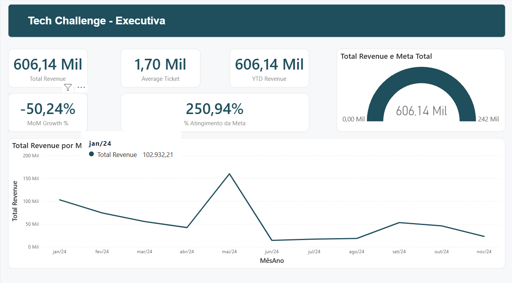
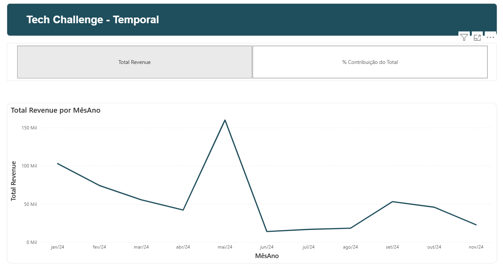
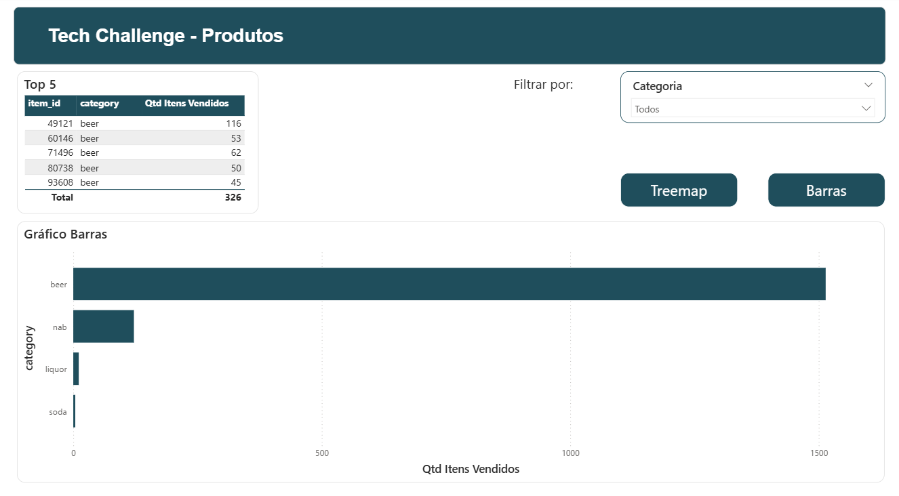
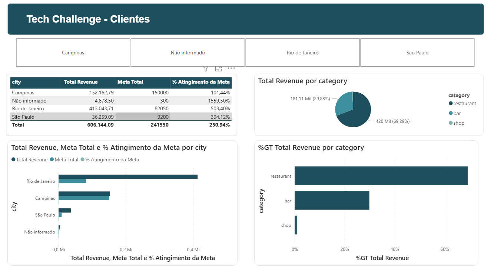
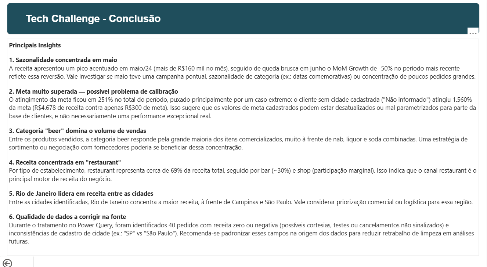

# Personalization Insights — Power BI Case Study

A end-to-end Power BI case study built for a Data Analyst technical interview with **AB InBev's Personalization Bees team**. The project simulates a real-world analytical scenario, combining a robust data model, advanced DAX, and an interactive, presentation-ready report.

> ⚠️ **Disclaimer:** This is an independent case study created for a job interview process. It uses sample/simulated data and is **not affiliated with, endorsed by, or representative of AB InBev's actual internal systems, data, or business strategy.**

---

## 🎯 Project Goal

Design and build a Power BI solution capable of answering personalization and customer-behavior questions through a scalable, well-structured data model — while showcasing best practices in dimensional modeling, DAX, and report UX.

---

## 🧱 Data Model

The solution is built on a **star schema** with **two fact tables**, connected through shared dimensions to support multi-grain analysis without relationship ambiguity.

- **Fact Table 1:** `<describe here — e.g., Sales / Transactions>`
- **Fact Table 2:** `<describe here — e.g., Customer Interactions / Personalization Events>`
- **Dimensions:** Date, Customer, Product, `<add others>`

Key modeling decisions:
- Resolved **relationship ambiguity** between fact tables by isolating shared dimensions and validating filter context propagation.
- Used **Field Parameters** to let end users dynamically switch between metrics/dimensions in the same visual — reducing report clutter and enabling self-service exploration.
- Debugged and corrected **measure context errors** (row vs. filter context) that surfaced during iterative testing.

---

## 📐 DAX Highlights

- Calculated measures built with attention to **context transition** (`CALCULATE`, `ALLEXCEPT`, iterators).
- Metrics designed to work correctly across both fact tables via the shared dimension model.
- `<Add 1–2 standout DAX formulas here with a short explanation — great for recruiters skimming the repo>`

```dax
-- Example placeholder, replace with an actual measure from the case
Total Personalized Interactions = 
CALCULATE(
    COUNTROWS('Fact_Interactions'),
    'Fact_Interactions'[IsPersonalized] = TRUE()
)
```

---

## 🎨 Report Design & UX

- **Bookmark navigation** for a guided, presentation-style flow across pages.
- **Custom JSON theme** for consistent branding and visual polish.
- **Field Parameters** enabling dynamic metric/dimension switching within the same visual.
- Clean, recruiter/stakeholder-friendly layout focused on storytelling over clutter.

---

## 🖼️ Screenshots

> Add 2–4 screenshots or a short GIF walkthrough here — this is the section people look at first.

| Overview | Personalization Analysis |
|---|---|
|  |  |
|  |  |
|  |  |

---

## 🛠️ Tech Stack

- **Power BI Desktop** — data modeling, DAX, report design
- **Power Query (M)** — data transformation
- **DAX** — calculated measures and columns
- **Field Parameters** — dynamic report interactivity
- Custom **JSON report theme**

---

## 📂 Repository Structure

```
├── PBIX/
│   └── personalization-case-study.pbix
├── assets/
│   └── (screenshots, GIFs)
├── docs/
│   └── (optional: case study write-up, data dictionary)
└── README.md
```

---

## 🚀 How to Explore

1. Clone this repo
2. Open `personalization-case-study.pbix` in **Power BI Desktop**
3. Use the bookmark navigation bar to walk through the story
4. Try the Field Parameters selector to explore different metric views

---

## 👤 About Me

I'm a Data Analyst / BI Developer specializing in Power BI, DAX, Power Query, and Microsoft Fabric, with a background in logistics and operations analytics.

- 🔗 [LinkedIn](#)
- 💼 [Portfolio / Other Projects](#)

---

⭐ If you found this case study interesting, feel free to star the repo or reach out — always happy to talk data modeling and DAX!
